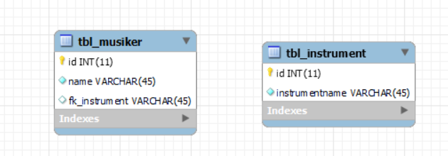

# Introduction
In diesem Modul geht es darum, eine API von Grund auf zu erstellen. Für diese Aufgabe werden wir PHP benutzen. Dies liegt daran, dass die meisten anderen Optionen schon zu viel für einen machen. Die Aufgabe beinhaltet kein Frontend. Zusätzlich dazu, muss eine Doku geführt werden. Dies ist der Anfang dieser Dokumentation. Die API welche ich im Rahmen dieses Moduls erstellen werde dient dem Zweck, Musiker für eine Aufführung auszuwählen. Zu diesem Zweck enthaltet die Datenbank Informationen über die Instrumente, welche jeder Musiker spielt, sowie die Hauptmusikrichtung jedes Musikers.

# Architektur
 - PHP
 - MySql

# ERD
